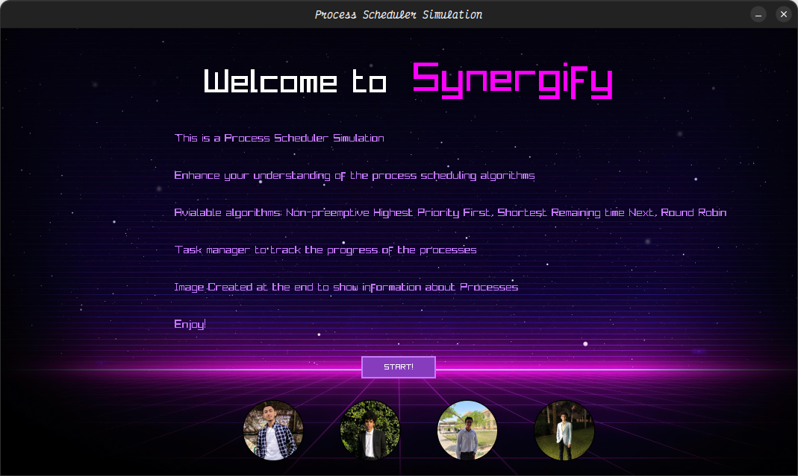
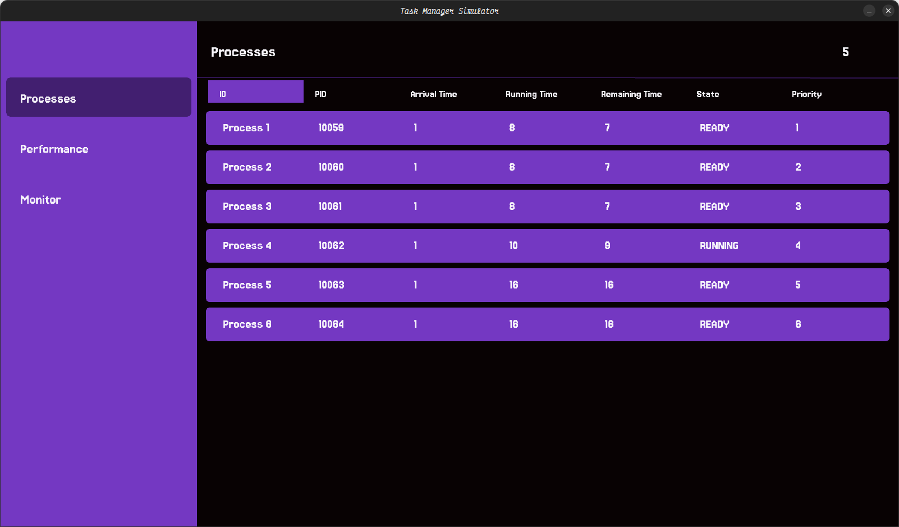
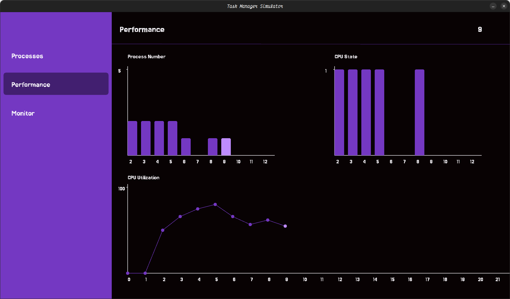
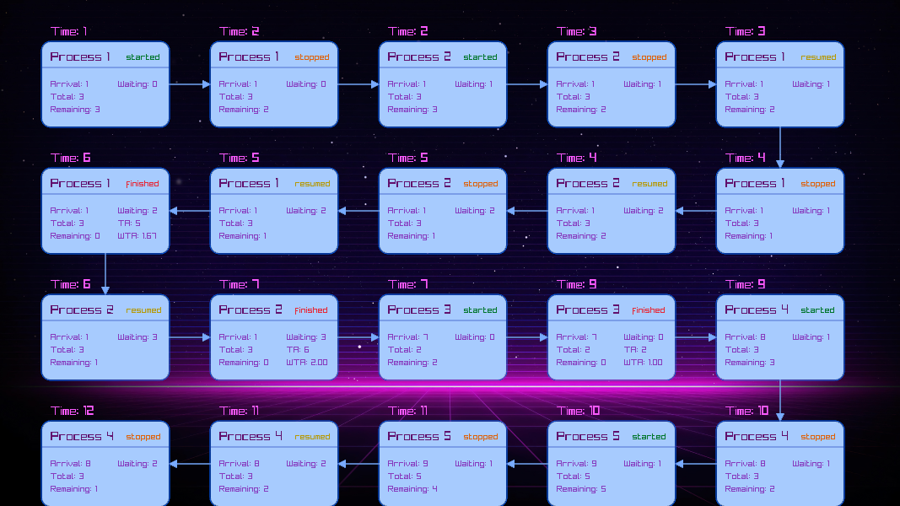
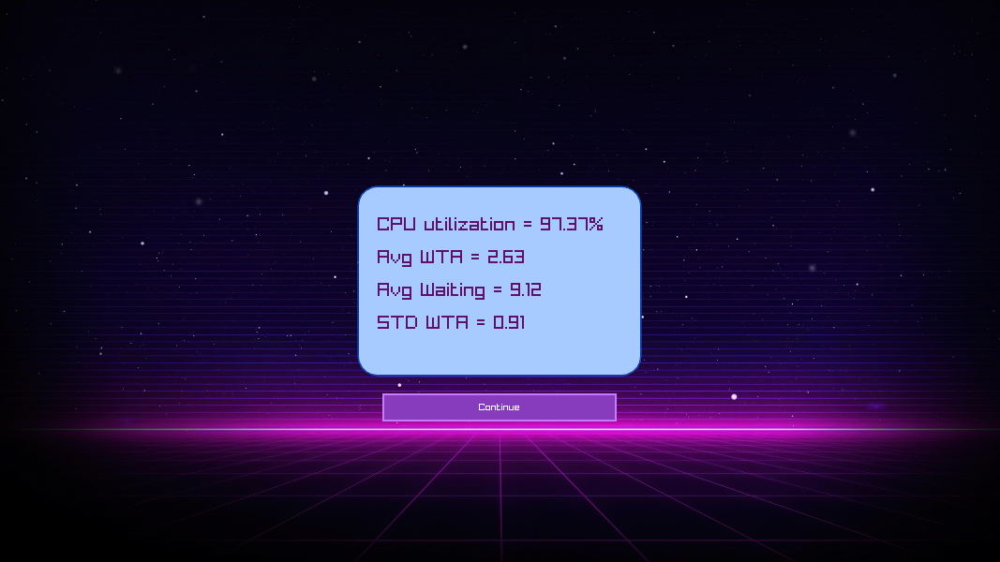

# Synergify

Synergify is a Process Management System with a sleek Task Manager GUI, developed in C. It offers a comprehensive platform for simulating process management using Inter-Process Communication (IPC) techniques, providing users with intuitive control over processes and their interactions.




## Features

- **Task Manager GUI**: A user-friendly graphical interface to manage processes.
- **Process Simulation**: Simulates various aspects of process management.
- **IPC Techniques**: Implements Inter-Process Communication for process interaction.
- **Real-time Updates**: Live updates and monitoring of process states and interactions.
- **Logging and Performance Metrics**: Generates log files for process simulation and performance files to evaluate scheduler efficiency.

## Prerequisites

Before you can build and run Synergify, you'll need to have the following dependencies installed:

- **raylib**: A simple and easy-to-use library to enjoy videogames programming.
  
  To download and install raylib, follow these steps:

  1. **Clone the raylib repository**:
     ```bash
     git clone https://github.com/raysan5/raylib.git
     cd raylib
     ```

  2. **Follow raylib [installation guide](https://github.com/raysan5/raylib?tab=readme-ov-file#build-and-installation)**

## Installation

To install Synergify, follow these steps:

1. **Clone the repository**:
   ```bash
   git clone https://github.com/The-White-Hats/Synergify.git
   cd Synergify
   ```

2. **Build the project**:
   ```bash
   make
   ```

3. **Run the application**:
   ```bash
   make run
   ```

## Usage

Once the application is running, you can use the Task Manager GUI to:

- **Select Scheduler Algorithm**: Choose from multiple scheduling algorithms such as HPF, SRTN, and RR.
- **Monitor Processes**: Observe the execution of processes and sort them by any column header.


- **Check Performance**: View the scheduler's performance through informative graphs.


- **Access Logs and Performance Files**: Review the generated files that track process simulations and scheduler performance.
<div style="display: grid; grid-template-columns: 1fr 1fr; gap: 15px;">
    
    
</div>

## License

Synergify is licensed under the MIT License. See the LICENSE file for more details.